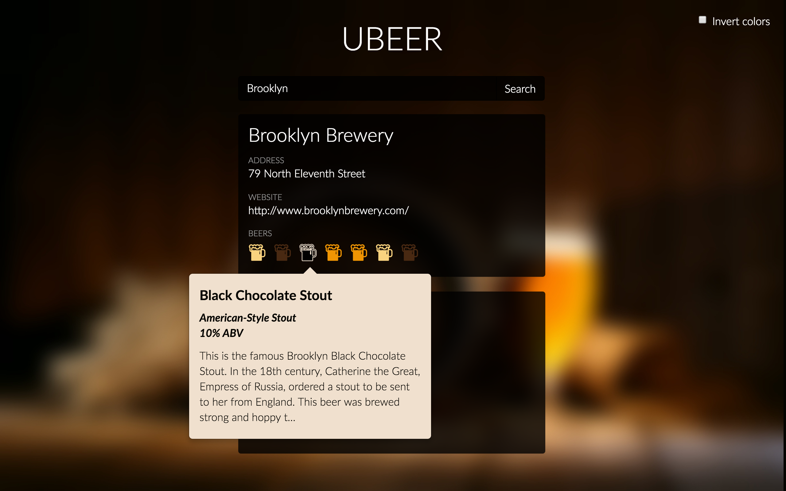
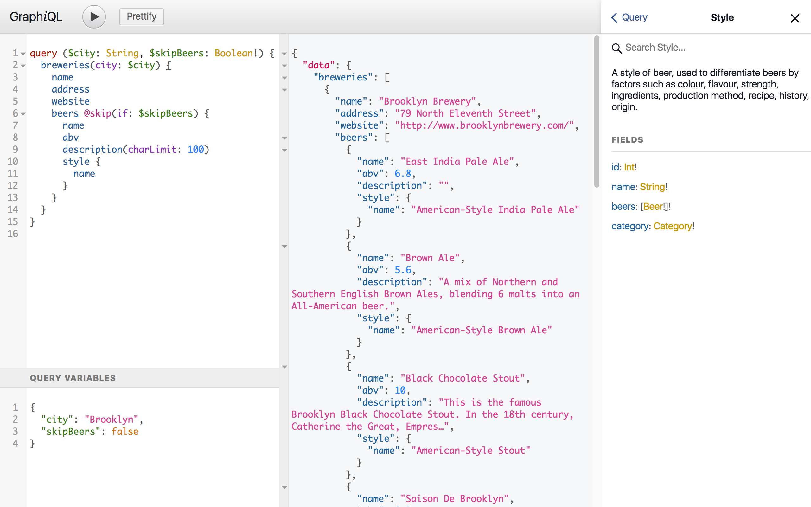
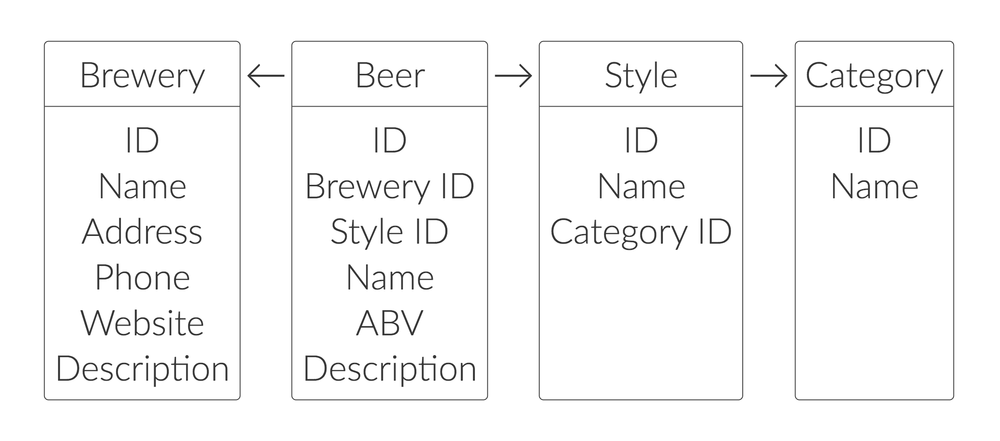

# Ubeer

Ubeer is a very simple client-server application where:

- The server exposes a [GraphQL](http://graphql.org/) endpoint using [Sangria](http://sangria-graphql.org/) and Akka HTTP.
- The client is a Vanilla JS application to locate breweries around you.

It was developed for a lightning talk I gave at
[NE Scala NYC 2017](http://www.nescala.org/) on 24 March 2017. The slides of
this talk can be found at <https://astori.fr/graphql-nescala>.

<p align="center">
  <a href="https://www.youtube.com/watch?v=6ttypoLyRaU">
    
    <br>
    <em>Watch the talk</em>
  </a>
</p>

<br>

<p align="center">
  
  &nbsp;&nbsp;&nbsp;&nbsp;&nbsp;
  
  <br>
  <em>The Ubeer client &amp; GraphiQL</em>
</p>

<p align="center">
  
  <br>
  
  <br>
  <em>Backend architecture</em>
</p>

## Running the project

In your console, run:

```sh
sbt run
```

This will compile the project, load the JSON files in memory, print the GraphQL
schema in the console and start the Akka HTTP server.

Once the server is started you can:

- Play with the client app at <http://localhost:8080/ubeer/index.html>.
- Run queries interactively using [GraphiQL](https://github.com/graphql/graphiql)
  at <http://localhost:8080/graphiql/index.html> (see below for some examples).

## Query examples

The following examples illustrate some capabilities GraphQL offers on this project.

Running these from the links given below assumes that you are running this
project locally (see above).

### Arguments

<a href="http://localhost:8080/graphiql/index.html?query=%7B%0A%20%20beer(id%3A%20360)%20%7B%0A%20%20%20%20name%0A%20%20%20%20description(charLimit%3A%2050)%0A%20%20%7D%0A%7D%0A&variables=">Run this example</a>

```graphql
{
  beer(id: 360) {
    name
    description(charLimit: 50)
  }
}
```

[More information about arguments](http://graphql.org/learn/queries/#arguments)

### Aliases

<a href="http://localhost:8080/graphiql/index.html?query=%7B%0A%20%20beerOne%3A%20beer(id%3A%20360)%20%7B%0A%20%20%20%20name%0A%20%20%7D%0A%20%20beerTwo%3A%20beer(id%3A%20440)%20%7B%0A%20%20%20%20name%0A%20%20%7D%0A%7D&variables=">Run this example</a>

```graphql
{
  beerOne: beer(id: 360) {
    name
  }
  beerTwo: beer(id: 440) {
    name
  }
}
```

[More information about aliases](http://graphql.org/learn/queries/#aliases)

### Reusable fragments

<a href="http://localhost:8080/graphiql/index.html?query=%7B%0A%20%20beerOne%3A%20beer(id%3A%20360)%20%7B%0A%20%20%20%20...beerSummary%0A%20%20%7D%0A%20%20beerTwo%3A%20beer(id%3A%20440)%20%7B%0A%20%20%20%20...beerSummary%0A%20%20%7D%0A%7D%0A%0Afragment%20beerSummary%20on%20Beer%20%7B%0A%20%20name%0A%20%20brewery%20%7B%0A%20%20%20%20name%0A%20%20%7D%0A%7D%0A&variables=">Run this example</a>

```graphql
{
  beerOne: beer(id: 360) {
    ...beerSummary
  }
  beerTwo: beer(id: 440) {
    ...beerSummary
  }
}

fragment beerSummary on Beer {
  name
  brewery {
    name
  }
}
```

[More information about fragments](http://graphql.org/learn/queries/#fragments)

### Variables

<a href="http://localhost:8080/graphiql/index.html?query=query%20(%24city%3A%20String)%20%7B%0A%20%20breweries(city%3A%20%24city)%20%7B%0A%20%20%20%20name%0A%20%20%20%20address%0A%20%20%20%20website%0A%20%20%7D%0A%7D%0A&variables=%0A%7B%0A%09%22city%22%3A%20%22Brooklyn%22%0A%7D">Run this example</a>

```graphql
query ($city: String) {
  breweries(city: $city) {
    name
    address
    website
  }
}
```

And in the *Query variables* tab:

```json
{
  "city": "Brooklyn"
}
```

[More information about variables](http://graphql.org/learn/queries/#variables)

### Directives

<a href="http://localhost:8080/graphiql/index.html?query=query%20(%24skipBeers%3A%20Boolean!)%20%7B%0A%20%20breweries%20%7B%0A%20%20%20%20name%0A%20%20%20%20address%0A%20%20%20%20website%0A%20%20%20%20beers%20%40skip(if%3A%20%24skipBeers)%20%7B%0A%20%20%20%20%20%20name%0A%20%20%20%20%20%20abv%0A%20%20%20%20%7D%0A%20%20%7D%0A%7D%0A&variables=%7B%0A%20%20%22skipBeers%22%3A%20false%0A%7D">Run this example</a>

```graphql
query ($skipBeers: Boolean!) {
  breweries {
    name
    address
    website
    beers @skip(if: $skipBeers) {
      name
      abv
    }
  }
}
```

And in the *Query variables* tab:

```json
{
  "skipBeers": false
}
```

[More information about directives](http://graphql.org/learn/queries/#directives)

### Introspection

<a href="http://localhost:8080/graphiql/index.html?query=%7B%0A%20%20__schema%20%7B%0A%20%20%20%20types%20%7B%0A%20%20%20%20%20%20kind%0A%20%20%20%20%20%20name%0A%20%20%20%20%20%20description%0A%20%20%20%20%7D%0A%20%20%7D%0A%0A%20%20__type(name%3A%20%22Beer%22)%20%7B%0A%20%20%20%20kind%0A%20%20%20%20name%0A%20%20%20%20description%0A%20%20%20%20fields%20%7B%0A%20%20%20%20%20%20name%0A%20%20%20%20%20%20type%20%7B%0A%20%20%20%20%20%20%20%20kind%0A%20%20%20%20%20%20%20%20name%0A%20%20%20%20%20%20%20%20ofType%20%7B%0A%20%20%20%20%20%20%20%20%20%20name%0A%20%20%20%20%20%20%20%20%7D%0A%20%20%20%20%20%20%7D%0A%20%20%20%20%20%20args%20%7B%0A%20%20%20%20%20%20%20%20name%0A%20%20%20%20%20%20%20%20type%20%7B%0A%20%20%20%20%20%20%20%20%20%20kind%0A%20%20%20%20%20%20%20%20%20%20name%0A%20%20%20%20%20%20%20%20%7D%0A%20%20%20%20%20%20%7D%0A%20%20%20%20%7D%0A%20%20%7D%0A%7D%0A&variables=">Run this example</a>

```graphql
{
  __schema {
    types {
      kind
      name
      description
    }
  }

  __type(name: "Beer") {
    kind
    name
    description
    fields {
      name
      type {
        kind
        name
        ofType {
          name
        }
      }
      args {
        name
        type {
          kind
          name
        }
      }
    }
  }
}
```

[More information about introspection](http://graphql.org/learn/introspection/)

## About the data

The [JSON data files](https://github.com/astorije/ubeer/tree/master/src/main/resources)
come from the [Open Beer Database](https://openbeerdb.com/) project, converted
from CSV to JSON (with some cleanup and reformatting along the way) using
[this tool](http://www.convertcsv.com/csv-to-json.htm).

Thanks to them for making these available!

However, note that data in these files is dated from 2011, and I had to delete
more than half the beers whenever they were lacking a style, a brewery, etc.
If anyone knows of a more up-to-date and sanitized list of beers and breweries,
let me know!
